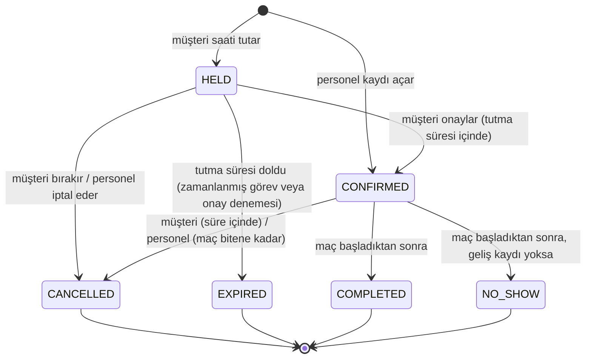
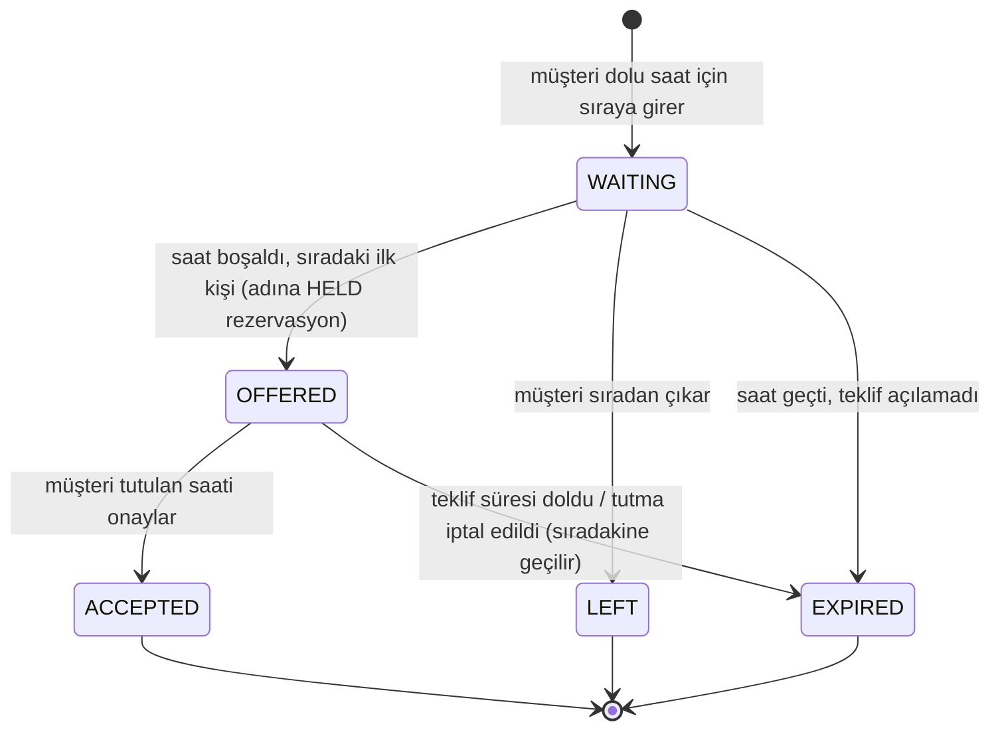
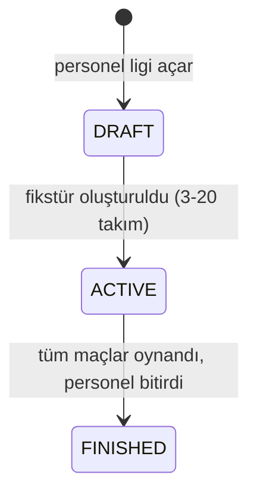

# Rezervasyon durumları, fiyat ve iptal kuralları

## Rezervasyon durum makinesi

| Durum | Ekrandaki ad | Sahayı meşgul eder mi? |
|---|---|---|
| `HELD` | Geçici tutuluyor | Evet |
| `CONFIRMED` | Onaylandı | Evet |
| `COMPLETED` | Tamamlandı | Evet (geçmiş zaman) |
| `NO_SHOW` | Gelmedi | Evet (geçmiş zaman) |
| `CANCELLED` | İptal edildi | Hayır (`active=false`) |
| `EXPIRED` | Süresi doldu | Hayır (`active=false`) |

"Geldi" bir durum değil, `CONFIRMED` rezervasyondaki `checked_in_at` alanıdır (maçtan en fazla 1 saat önce
ile maç bitişi arasında kaydedilir).

Kurallar `Reservation` sınıfındadır; geçersiz geçiş, kod nereden çağrılırsa çağrılsın reddedilir
(`ReservationLifecycleTest`). Personel panelindeki düğmeler aynı sınıfın `canCheckIn(now)` gibi
sorgularından üretilir; geçersiz düğme gösterilmez.

**Ödeme durumu rezervasyon durumundan ayrıdır** ve hareketlerden hesaplanır (ör. "Onaylandı + Kapora
bekleniyor"). Ayrıntı: [ODEME.md](ODEME.md).

Şubede kapora kuralı varsa müşterinin geçici tutması **kapora ödemesiyle** onaylanır (ödeme bildirimi
HELD → CONFIRMED geçişini yapar); ödemesiz "onayla" düğmesi gösterilmez ve sunucuda da reddedilir.

## Süresi dolan tutmalar

- Tutma süresi şube ayarıdır (`branch.hold_minutes`, varsayılan 10 dk).
- `HoldExpiryJob` her 30 sn `HoldExpiryService.expireDueHolds()` çağırır:
  `status='HELD' AND hold_expires_at <= now` satırları `FOR UPDATE SKIP LOCKED` ile 100'erli kilitlenir,
  EXPIRED yapılır, doluluk kapatılır. Tekrar çalıştırmak güvenlidir.
- Müşteri süre dolduktan sonra onaylamaya çalışırsa rezervasyon o anda EXPIRED yapılır (görevi beklemeden).
- Sınır: `hold_expires_at` anı dahil süre dolmuş sayılır.

## Düzenli rezervasyon (seri)

- Seri, haftalık tekrar eden maçların **kuralıdır** (`reservation_series`: ilk tarih, saat, süre, adet).
  Her maç ayrı bir `reservation` satırıdır (`series_id`, `series_index`); kendi durumu, fiyatı ve ödemesi vardır.
- Adet 2 ile `sahahub.booking.series-max-occurrences` (varsayılan 26) arasındadır.
- Önizlemede her tarih: **Uygun**, **Dolu** (rezervasyon veya bakım kapatması), **Şube kapalı**, **Geçmiş**.
- "Tümünü oluştur" yalnızca hepsi uygunsa çalışır. Değilse personel tarihleri tek tek işaretler
  ("Yalnızca seçili tarihleri oluştur"); işaretlenmeyen tarih sessizce atlanmaz.
- Oluşturma tek transaction'dır. Önizlemeden sonra bir tarih dolmuşsa hiçbir maç oluşmaz; personel güncel
  önizlemeyi görür (`SeriesIT.concurrentSeriesNeverLeavesPartialSeries`).
- "Bu ve sonraki maçları iptal et": seçilen maç ve sonrasındaki açık (HELD/CONFIRMED) maçlar iptal edilir;
  önceki maçlar etkilenmez. Gerekçe zorunlu.

## Bekleme listesi

- Yalnızca **dolu** saat için sıraya girilir; boş saat için doğrudan rezervasyon yapılır.
- Bir müşteri aynı saat için bir kez, aynı anda en fazla 5 saat için sırada olabilir.
- Sıra, sıraya giriş zamanına göredir. Teklif süresi `sahahub.waitlist.offer-minutes` (varsayılan 15 dk).
- Teklif sırasında saat, teklif alan kişi adına HELD durumdadır; başkası (sıradaki dahil) alamaz.
  Süre dolunca mevcut tutma süresi görevi saati serbest bırakır ve sıradakine yeni teklif açılır.
- Aynı saat için en fazla bir açık teklif olur (`ux_waitlist_one_offer`); eşzamanlı teklif denemelerinden
  yalnızca biri başarılı olur (`WaitlistIT.concurrentOfferAttemptsCreateExactlyOneOffer`).

## Bildirimler

| Olay | Bildirim | Tekrar anahtarı |
|---|---|---|
| Rezervasyon onaylandı (seri dışı) | "Rezervasyonunuz onaylandı" | `confirmed:{id}` |
| Rezervasyon iptal edildi | "Rezervasyonunuz iptal edildi" (kim iptal etti) | `cancelled:{id}` |
| Seri oluşturuldu | Tek bildirim (maç sayısı, ilk tarih) | `series:{id}` |
| Bekleme teklifi | "Beklediğiniz saat boşaldı" + son onay saati | `offer:{kayıt}` |
| Maça 24 saatten az | "Maç hatırlatması" | `reminder:{id}` |
| Maça 48 saatten az, kapora ödenmemiş | "Kapora bekleniyor" | `deposit-reminder:{id}` |
| Takım maçı eklendi / iptal edildi | Kaptan dışındaki üyelere | `team-match:{maç}:{kişi}`, `team-match-cancelled:{maç}:{kişi}` |
| Takım maçına 24 saatten az | "Takım maçı yaklaşıyor": güncel sayılar + kişinin yanıtı; "Gelmiyorum" diyenlere gitmez. Maç 24 saatten az kala eklendiyse gitmez (ekleme bildirimi yeni). | `team-match-reminder:{maç}:{kişi}` |

Uygulama içi bildirim her zaman yazılır. E-posta (varsayılan açık) ve SMS (varsayılan kapalı, telefon
gerekli) müşterinin tercihidir. Misafir rezervasyonunda telefon varsa yalnızca demo SMS oluşur.

## Lig

Maç: `UNSCHEDULED → SCHEDULED` (saha ve saat; `pitch_occupancy` kaynak `TOURNAMENT_MATCH`) → `PLAYED` (skor,
yalnızca maç başladıktan sonra). Planlı maç yeniden planlanabilir veya planı kaldırılabilir (saha boşalır, bekleme
listesine teklif açılır). Oynanmış maçın skoru düzeltilebilir (denetim kaydı `MATCH_RESULT_CORRECTED`); saati
değişmez.

- **Fikstür**: round-robin ("daire yöntemi"). n takımda n−1 hafta (tek sayıda takımda her hafta bir takım "bay"
  geçer, n hafta). Tek devrede her ikili bir kez, çift devrede ev/deplasman değişerek iki kez karşılaşır.
- **Haftalık planlama**: k. haftanın maçları ilk tarih + (k−1) hafta günü, seçilen sahada art arda. Tek
  transaction: bir maçın saati dolu, geçmiş veya şube kapalıysa hiçbir maç planlanmaz, hata maçı adıyla söyler.
- **Puan durumu** saklanmaz; oynanmış maçlardan hesaplanır. Sıralama: puan → averaj → atılan gol → ad.
  İkili averaj uygulanmaz.

## Eleme usulü turnuva (kupa)

- Takımların eklenme sırası **tohum sırasıdır** (ilk eklenen 1. sıra). Ağaç boyu takım sayısından büyük-eşit en
  küçük 2'nin kuvvetidir; standart tohumlamayla (8'lik: 1-8, 4-5, 2-7, 3-6) 1. ve 2. tohum ancak finalde karşılaşır.
- Eksik yerler **bay**dır ve en üst tohumlara düşer: bay geçen takım maç yapmadan ikinci tura çıkar. İki bay
  karşılaşmaz. Toplam maç sayısı takım − 1'dir.
- Maç satırı yalnızca iki tarafı belli olunca oluşur: ilk tur "Eşleşmeleri oluştur"da, sonraki turlar sonuçlar
  girildikçe aynı transaction'da açılır (turnuva satırı kilitli; `(turnuva, tur, yer)` tekil indeksi).
- Beraberlikte **penaltı galibi** seçilir; veritabanında da "eleme maçı penaltısız berabere bitemez" kısıtı var.
- **Düzeltme**: galibi değiştirmeyen skor düzeltmesi her zaman; galibi değiştiren düzeltme yalnızca o galibin
  sonraki tur maçı oynanmadıysa (o maçın takımı güncellenir). Oynandıysa reddedilir. Hepsi denetim kaydında.
- Turnuva final oynanınca bitirilebilir; şampiyon ağacın son yerindeki galiptir.
- Tur adları: Final, Yarı final, Çeyrek final, Son 16, daha öncesi "N. tur".

## Takım maçı ve katılım

- Takım maçı: `SCHEDULED → PLAYED` (kaptan skoru maç başladıktan sonra girer, düzeltebilir) veya
  `SCHEDULED → CANCELLED` (kaptan iptal etti ya da bağlı rezervasyon iptal edildi; üyelere bildirim gider).
- Kaptanın onaylı, ileri tarihli rezervasyonuna bağlanabilir (yer/saat oradan); aynı rezervasyon aynı takıma
  ikinci kez eklenemez. Serbest maç gelecek 90 gün içinde olmalı.
- Üye yanıtı: Geliyorum / Kararsızım / Gelmiyorum. Maç başlayana kadar değiştirilebilir; kişi başına tek yanıt.
  Takımdan ayrılan üyenin yanıtı sayılmaz. "Yanıt vermedi" = aktif üye − yanıt verenler.

## Takım ve ilan

- Takım: kuran kaptandır. Kaptan, başka üye varken ayrılamaz (önce kaptanlığı devreder); tek üye kaptan ayrılırsa
  takım dağılır. Dağılan takımın açık ilanları kapanır.
- İlan: `OPEN → FILLED` (kontenjan doldu; oyuncu ilanında aranan sayı, rakip ilanında 1) veya `OPEN → CLOSED`
  (ilan sahibi kapattı, bağlı rezervasyon iptal edildi, takım dağıldı). Süre dolumu ayrı durum değildir:
  `expires_at` geçmişse ilan "Süresi doldu" görünür ve başvuru almaz. Maç zamanı varsa bitiş odur, yoksa 7 gün.
- Başvuru: `PENDING → ACCEPTED / REJECTED / WITHDRAWN`. İlan dolunca bekleyen başvurular "kabul edilmedi" olur
  ve başvuranlara bildirim gider.

## Fiyat hesabı

1. Süre dakika dakika ele alınır; her dakikaya, şubenin yerel saatinde o dakikanın başlangıcına uyan
   kural uygulanır. 17:30–18:30 maçında 18:00 akşam tarifesi son 30 dakikaya uygulanır.
2. Birden fazla kural uyarsa **en yüksek `priority`**, eşitlikte **daha yeni (büyük id)** kural kazanır.
   Hiçbiri uymazsa sahanın standart saatlik ücreti.
3. Aynı ücretli ardışık dakikalar tek kalem olur.
4. Kalem tutarı = saatlik ücret × dakika ÷ 60, **kuruşa HALF_UP** yuvarlanır. Toplam = kalemlerin toplamı.
5. Hazırlık süresi ücretlendirilmez. Para birimi TRY; tüm hesaplar `BigDecimal`.
6. Kalemler `reservation_price_line` tablosuna kopyalanır; tarife sonradan değişse de rezervasyon değişmez.
7. **Taşıma** fiyatı değiştirmez (anlık görüntü korunur). Fark gerekiyorsa personel indirimi veya ek
   hizmet kalemiyle düzeltilir.

Saha ücretinin üzerine sırasıyla: ek hizmetler → kupon → personel indirimi (gerekçeli); kapora son
toplamdan hesaplanır. Ayrıntı ve yuvarlama: [ODEME.md §2](ODEME.md).

## İptal sınırı

Müşteri onaylı rezervasyonu **maç başlangıcı − iptal süresi** anına kadar (bu an dahil) iptal edebilir.
24 saat kuralında 2 Ekim 21:00 maçı için 1 Ekim 21:00:00 hâlâ iptal edilebilir, 21:00:01 edilemez
(`ReservationRulesIT.CancellationCutoff`). Sonrasında iptali personel yapar (gerekçe zorunlu).
