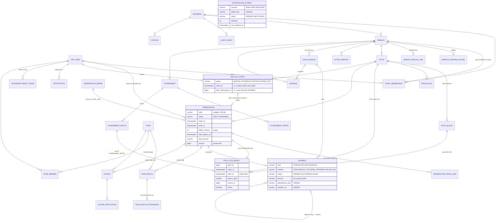

# Mimari

## 1. Kararlar (özet)

| # | Karar | Gerekçe |
|---|---|---|
| 1 | Java 25 LTS + Spring Boot 4.1.1 | Boot 4.1 Java 17–26 destekler; 25 desteklenen en yeni LTS. JDK 27 desteklenmiyor. |
| 2 | Modüler monolit (paket = modül) | Tek dağıtım birimi, tek veritabanı; mikroservis/kuyruk yükü yok. Modül sınırları paketlerle korunur. |
| 3 | PostgreSQL 18.6, Flyway | Zaman aralığı kısıtı (EXCLUDE + btree_gist) çakışma güvencesinin temeli. Şema yalnızca migration ile değişir (`ddl-auto: validate`). |
| 4 | Tüm doluluk kaynakları tek tabloda (`pitch_occupancy`) | Rezervasyon, bakım bloğu ve ileride turnuva maçı aynı kısıtla korunur; tablolar arası EXCLUDE mümkün değildir. |
| 5 | Kısıta ek olarak saha başına advisory lock | Kısıt tek başına doğru ama eşzamanlı eklemede PostgreSQL deadlock'a (40P01) düşüyordu; test bunu yakaladı. Kilit, kaybedeni temiz "saat dolu" hatasına çevirir. |
| 6 | Aktiflik açık durum geçişiyle (`active=false`) | Kısıtta `now()` kullanılamaz (değişken ifade). Süresi dolan tutmayı zamanlanmış görev açıkça EXPIRED yapar. |
| 7 | Thymeleaf + HTMX 2.0.11 (yerel dosya) | Sunucu taraflı, JS'siz de çalışan sayfalar; panel ve gün değişimi HTMX ile. CDN bağımlılığı yok. |
| 8 | Personel takvimi kendi yazımımız | FullCalendar'ın sahaya göre sütunlu "resource" görünümleri ücretli Premium lisans ister. |
| 9 | Fiyat dakika bazında hesaplanır, kalemler kopyalanır | Sınır aşan maçlar adil bölünür; tarife değişse de eski rezervasyon değişmez. |
| 10 | Entity yerine record DTO'lar şablona gider, `open-in-view: false` | Görünüm katmanı veritabanına erişemez; tembel yükleme sürprizi olmaz. |
| 11 | Oturum tabanlı kimlik + CSRF + CSP | Sunucu render'lı uygulama için en basit güvenli seçim. |
| 12 | `Clock` bean'i | "Şimdi" testte sabitlenir; iptal sınırı gibi kurallar kesin anda denenir. |
| 13 | Ödeme durumu saklanmaz, hareketlerden hesaplanır | Hareketlerle çelişen "ödendi" bayrağı oluşamaz; rezervasyon durumu ile ödeme durumu ayrı kalır. |
| 14 | Ödeme hareketleri silinmez/değişmez; ters kayıt ve iade | Geçmiş izlenebilir; düzeltmeler de kayıtlıdır. |
| 15 | Her ödeme isteğinde idempotency anahtarı (DB UNIQUE), webhook olayında `(provider, event_id)` UNIQUE | Çift tıklama, ağ tekrarı ve yinelenen bildirim çift tahsilat/iade üretmez. |
| 16 | `PaymentProvider` adaptörü + simülasyon sağlayıcı (ayrı tablolar, imzalı webhook, gecikmeli teslim) | Gerçek sağlayıcı aynı arayüzle eklenir; senaryolar (gecikme, yinelenen, geç ödeme) gerçekçi denenir. |
| 17 | Geç ödeme ve müşteri iptalinde otomatik iade `@TransactionalEventListener(AFTER_COMMIT)` ile | İade, olayı doğuran değişiklik kesinleşmeden başlamaz; kendi transaction'ında çalışır. |
| 18 | Para girişi `MoneyInputFormatter` | Türkçe "1.400,50" ve "1400.50" yazımı kabul edilir. |
| 19 | Düzenli rezervasyonda her maç ayrı `reservation` (`series_id`, `series_index`) | Tek maç taşınabilir, iptal edilebilir, ayrı ödenir; çakışma güvencesi aynı EXCLUDE kısıtından gelir. Seri oluşturma tek transaction: bir tarih dolarsa hiçbiri oluşmaz. |
| 20 | Önizlemede uygun olmayan tarih varsa "tümü" reddedilir; atlama yalnızca açık seçimle | Personel bir haftanın sessizce düştüğünü fark etmeden müşteriye "8 maç" sözü vermez. |
| 21 | Bekleme teklifi = sıradaki adına HELD rezervasyon | "Bir boşluk iki kişiye verilmez" için ikinci bir kilit mekanizması yazmak yerine mevcut kısıt kullanılır; teklif süresi dolunca mevcut süre dolumu görevi serbest bırakır ve sıradakine geçilir. |
| 22 | Bildirimler transactional outbox (`notification_outbox`), BEFORE_COMMIT'te yazılır | Geri alınan işlem e-posta üretmez; SMTP yavaşlığı kullanıcı isteğini bekletmez. Gönderici `FOR UPDATE SKIP LOCKED` ile paralel çalışabilir. |
| 23 | `dedup_key` UNIQUE + `ON CONFLICT DO NOTHING` | Hatırlatma görevi her çalıştığında aynı mesajı yeniden üretmez; olay iki kez işlense de tek bildirim. |
| 24 | Lig maçı `pitch_occupancy` kaynağı (`TOURNAMENT_MATCH`); planlama rezervasyonla aynı `OccupancyService` | Senaryo 14 için ikinci bir çakışma mekanizması yok; maç ve rezervasyon aynı EXCLUDE kısıtı ve advisory lock'la sıraya girer. Kaynak türü V1'de öngörülmüştü. |
| 25 | Takvim maçları `MatchCalendarPort` ile alır | Rezervasyon modülü lig modülünü tanımaz (bağımlılık `tournament → booking`), PaymentStatusPort ile aynı desen. |
| 26 | Puan durumu saklanmaz, hesaplanır (`Standings`) | Skor düzeltmesi tabloya kendiliğinden yansır; tutarsız "puan" sütunu oluşmaz. |
| 27 | İlan kabulünde kilit sırası: ilan → başvuru | Kontenjan eşzamanlı kabullerde aşılmaz; geri çekme ile kabul aynı kilit sırasını izlediği için deadlock'a girmez. |
| 28 | Takım katılımı yalnızca davet koduyla; takım sayfası yalnızca üyelere | Takım ve üye adları sızdırılmaz; kod yenilenince eski bağlantı geçersiz olur. |
| 29 | Rapor metrikleri saf bir hesaplayıcıda (`ReportCalculator`), veri tek seferde SQL ile yüklenir | Tanımlar tek yerde ve birim testle sabit; "rezervasyon bedeli", "tahsilat" ve "nakit farkı" kod düzeyinde ayrı kavramlar. Ayrıntı: [RAPORLAR.md](RAPORLAR.md). |
| 30 | `reservation.confirmed_at` sütunu (V5) | İptal oranında "onaydan sonra iptal" ile "tutmada bırakılan" ayrılamıyordu; eski kayıtlar migration'da doldurulur, bilinmeyenler belgelendi. |
| 31 | Saha fotoğrafı dosya sisteminde, içerikten tür tespiti ve yeniden kodlama | Veritabanı şişmez; istemcinin bildirdiği türe güvenilmez; EXIF/konum silinir; dosya yalnızca erişim kontrollü uçtan sunulur. |
| 32 | Parola sıfırlama e-postası outbox'tan değil, commit sonrası doğrudan gönderilir | Outbox gövdesi bağlantıyı (token) düz metin saklardı. Gönderim başarısızsa kullanıcı yeniden ister; bu akışta "en az bir kez" teslim gerekmiyor. |
| 33 | `SessionRegistry` ile parola değişince oturumların sonlandırılması | Çalınmış bir oturum parola değişikliğinden sonra açık kalmaz. Tek sunucu varsayımı (kayıt bellekte). |
| 34 | Eleme ağacı saf bir sınıfta (`Bracket`) hesaplanır; maç satırı yalnızca iki taraf belli olunca açılır | "Bekleniyor" taraflı boş satırlar ve onları sonradan doldurma mantığı gerekmez; ağaç her zaman oynanmış maçlardan yeniden hesaplanır. Düzeltmede yalnızca oynanmamış sonraki maçın takımı güncellenir. |
| 35 | Görsel doğrulama ve saklama ortak (`shared.image`: `ImageNormalizer`, `UploadStore`) | Saha fotoğrafı ve takım logosu aynı güvenlik kurallarından geçer; kural tek yerde. |
| 36 | Katılım yanıtı tablo satırı (`team_match_attendance`, birincil anahtar maç+kişi), `INSERT … ON CONFLICT DO UPDATE` | Yanıt değiştirmek tek ifade; aynı kişinin iki yanıtı oluşamaz. Sayımlar her açılışta hesaplanır. |

## 2. Paketler (modüller)

```
com.sahahub
├── shared        ortak: Money, TimeRange, hata yönetimi, istek kimliği, denetim kaydı, görünüm biçimleri
├── identity      kullanıcı, personel ataması, rol→izin matrisi, AccessGuard, Spring Security
├── business      işletme, şube, çalışma saatleri, saha, bakım bloğu, katalog okuma
├── pricing       fiyat kuralı ve saf fiyat hesaplayıcı
├── booking       rezervasyon, doluluk, uygun saat hesabı, personel takvimi, süre dolumu görevi,
│                 ek hizmet/kupon/indirim kalemleri (ReservationPricingService)
├── payment       ödeme hareketleri, kasa, giderler, webhook; provider/ altında sağlayıcı adaptörü
│                 ve simülasyon sağlayıcısı
├── notification  uygulama içi bildirim, outbox, gönderici, kanallar (e-posta; SMS/WhatsApp demo),
│                 hatırlatma görevi
├── community     takımlar (logo, açıklama), davet, takım maçları ve katılım, oyuncu/rakip ilanları
├── tournament    lig (round-robin) ve eleme (kupa, Bracket), maç planlama, skor, puan durumu
├── reporting     rapor metrikleri (saf hesaplayıcı), şube raporu, şube karşılaştırması, CSV
├── platform      platform yöneticisi işlemleri
└── dev           yalnızca dev profilinde demo veri
```

Tüm planlanan modüller mevcut. `business` modülü ayrıca saha/şube ayarları, fotoğraf, personel ve denetim
ekranlarının servislerini içerir (identity'ye bağımlıdır, tersi değil).

**Bağımlılık yönü**: `payment → booking → business/pricing → identity → shared`. Rezervasyon modülünün
ödeme bilgisine ihtiyacı olan iki yer (takvim etiketi, kapora ödenmeden onay engeli) için
`booking.app.PaymentStatusPort` arayüzü tanımlıdır; uygulamasını `payment.app.PaymentQueries` verir
(Dependency Inversion). Rezervasyon iptali `ReservationCancelled` olayı olarak yayımlanır; ödeme modülü
commit sonrası dinler. Web katmanı (controller'lar) birden fazla modülü birleştirebilir.

`notification → booking` yönündedir: rezervasyon modülü bildirim modülünü tanımaz, yalnızca olay yayımlar
(`BookingEvents.ReservationConfirmed`, `SlotReleased`, `SeriesCreated`, `WaitlistOffered`,
`ReservationCancelled`). `notification.app.ReservationNotifications` bu olayları BEFORE_COMMIT dinleyip
aynı transaction'da bildirim satırı yazar.

```
İş işlemi (ör. personel iptali)                       ayrı görev (10 sn'de bir)
  ├─ reservation UPDATE, occupancy active=false        OutboxDispatcher.dispatchDue()
  ├─ olay: ReservationCancelled, SlotReleased            ├─ select … for update skip locked
  ├─ BEFORE_COMMIT: notification + outbox INSERT         ├─ kanal.send()  (SMTP → Mailpit / DEMO)
  │                 (on conflict (dedup_key) do nothing) └─ SENT  ya da  deneme+1, sonraki deneme
  └─ COMMIT ─► AFTER_COMMIT: WaitlistService.offerNext()        1/2/4/8 dk sonra, 5. denemede FAILED
               (her saat için REQUIRES_NEW; HELD teklif)
```

Her modülde katmanlar:

| Katman | Paket | Sorumluluk | Örnek |
|---|---|---|---|
| Web | `*.web` | HTTP ↔ servis çevirisi, form doğrulama, şablon seçimi | `StaffController` |
| Uygulama | `*.app` | Transaction sınırı, yetki kontrolü, akış | `CustomerBookingService` |
| Alan (domain) | `*.domain` | İş kuralları, entity, repository arayüzü; Spring'e bağımsız saf sınıflar | `Reservation`, `SlotCalculator`, `PriceCalculator` |

## 3. Çakışma güvencesi

```
CustomerBookingService.hold()                        PostgreSQL
  ├─ uygun saati doğrula (ekran bilgisi, garanti değil)
  ├─ reservation INSERT
  ├─ price_line INSERT ×n
  └─ OccupancyService.occupy()
        ├─ pg_advisory_xact_lock(0x5348, saha)   ── aynı sahadaki eşzamanlı ekleme burada sıraya girer
        └─ pitch_occupancy INSERT  ──────────────── EXCLUDE (pitch_id =, tstzrange [) &&) WHERE active
                                                    ihlal → 23P01 → SlotUnavailableException → rollback
```

- Aralıklar yarı açıktır `[başlangıç, bitiş)`: 20:00–21:00 ile 21:00–22:00 çakışmaz.
- Rezervasyonun doluluk bitişi = maç bitişi + hazırlık süresi (buffer). Buffer rezervasyona kopyalanır.
- Taşıma: aynı transaction'da eski doluluk `active=false` → yeni doluluk eklenir. Çakışırsa her şey
  geri alınır, eski saat korunur (`ReservationRulesIT.Move`).
- İptal / süre dolumu: doluluk satırı silinmez, `active=false` yapılır (geçmiş korunur).

## 4. Zaman

- Anlar `timestamptz` olarak (UTC) saklanır, Java'da `Instant`.
- Çalışma ve fiyat saatleri `time` (yerel saat), `LocalTime`.
- İş kuralları şubenin zaman diliminde (`branch.time_zone`, varsayılan `Europe/Istanbul`) değerlendirilir.
- **İş günü**: kapanış gece yarısını aşabilir (09:00–01:00). 00:30'daki maç önceki iş gününe aittir;
  müşteri ekranında "Gece yarısından sonra" bölümünde, personel takviminde o günün sütununda görünür.
- `hibernate.jdbc.time_zone` ayarı **kullanılmaz**: `LocalTime` değerlerini kaydırıyordu
  (00:00 → 22:00). Regresyon testi: `LocalTimePersistenceIT`.

## 5. Güvenlik

- BCrypt (`{bcrypt}` önekli, `DelegatingPasswordEncoder`), oturum kimliği girişte yenilenir.
- CSRF tüm POST formlarda (Thymeleaf otomatik ekler). CSP: `script-src 'self'` (satır içi script yok).
- Giriş hız sınırı: e-posta+IP başına 5 hatalı deneme → 15 dk kilit.
- Yetki: URL kuralları kaba süzgeç; asıl kontrol servislerde `AccessGuard` ile (rol + işletme/şube kapsamı).
  Kaydın şubesi **veritabanından** okunur, istekten gelen değere güvenilmez.
- Müşteri başkasının rezervasyon koduyla "bulunamadı" alır (kayıt varlığı sızdırılmaz).
- Personel işlemleri ve platform müdahaleleri `audit_event` tablosuna aynı transaction'da yazılır.
- Loglara parola/token yazılmaz; `AppUserPrincipal.toString()` yalnızca id içerir ve parola özeti girişten
  sonra bellekten silinir.
- Her isteğe `X-Request-Id`; loglarda `[requestId]`, hata sayfasında "Takip kodu".
- Güvenlik başlıkları (Aşama 6'da `curl` ile doğrulandı): CSP, `X-Content-Type-Options: nosniff`,
  `X-Frame-Options: DENY`, `Referrer-Policy: strict-origin-when-cross-origin`, `Permissions-Policy`
  (kamera/mikrofon/konum/ödeme kapalı), oturum çerezi `HttpOnly; SameSite=Lax` (+ canlıda `Secure`).
  Yalnızca `/actuator/health` açık, ayrıntı göstermez.
- Parola sıfırlama: 256 bit rastgele token, veritabanında SHA-256 özeti, 30 dk, tek kullanımlık, yeni istek
  eskileri geçersiz kılar; hesap başına saatte 3, IP başına saatte 10 istek; parola değişince oturumlar
  sonlanır (`PasswordResetIT`).
- Dosya yükleme: yalnızca JPEG/PNG (sihirli sayı), 3 MB ve 6000×6000 piksel üst sınırı, görüntü yeniden
  kodlanır, rastgele dosya adı, yükleme klasörü statik kaynakların dışında (`PitchPhotoServiceTest`, `AdminIT`).
- CSV dışa aktarmada formül enjeksiyonu koruması (`CsvWriterTest`).
- Bilinen sınırlar: giriş/parola sıfırlama hız sınırları ve oturum kaydı bellekte (tek sunucu); 10 MB'ı aşan
  yükleme isteği uygulamaya ulaşmadan 413 ile reddedilir ve genel "Dosya çok büyük" sayfası gösterilir
  (3–10 MB arası dosyalar formda "en fazla 3 MB" mesajı alır; curl ile ölçüldü);
  bağımlılık güvenlik taraması (OWASP dependency-check) NVD veri indirmesi gerektirdiği için çalıştırılmadı.

## 6. ER diyagramı



## 7. Silme ve arşiv kuralı

Rezervasyon, doluluk, fiyat kalemi, ödeme hareketi, kasa, gider ve denetim kayıtları **fiziksel olarak
silinmez**. Ek hizmet/indirim kalemi `voided_at`, ödeme ters kayıt/iade, gider ters kayıt, ek hizmet ve kupon
`active=false` ile kapatılır. İptal/süre dolumu
durum alanıyla, doluluk `active=false` ile, saha `active=false` ile, şube `archived=true` ile,
işletme `status=ARCHIVED/SUSPENDED` ile kapatılır.
