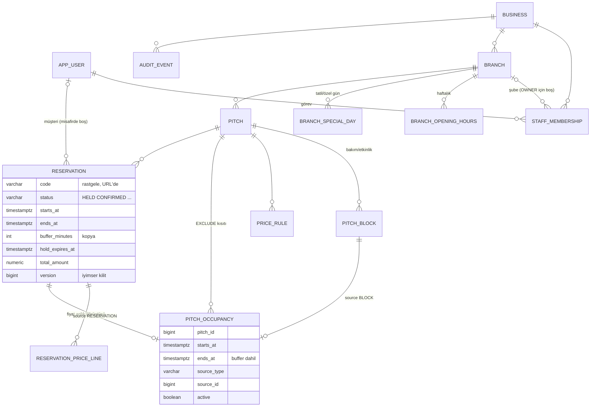

# Mimari

## 1. Kararlar (özet)

| # | Karar | Gerekçe |
|---|---|---|
| 1 | Java 25 LTS + Spring Boot 4.1.1 | Boot 4.1 Java 17–26 destekler; 25 desteklenen en yeni LTS. JDK 27 desteklenmiyor. |
| 2 | Modüler monolit (paket = modül) | Tek dağıtım birimi, tek veritabanı; mikroservis/kuyruk yükü yok. Modül sınırları paketlerle korunur. |
| 3 | PostgreSQL 18.6, Flyway | Zaman aralığı kısıtı (EXCLUDE + btree_gist) çakışma güvencesinin temeli. Şema yalnızca migration ile değişir (`ddl-auto: validate`). |
| 4 | Tüm doluluk kaynakları tek tabloda (`pitch_occupancy`) | Rezervasyon, bakım bloğu ve ileride turnuva maçı aynı kısıtla korunur; tablolar arası EXCLUDE mümkün değildir. |
| 5 | Kısıta ek olarak saha başına advisory lock | Kısıt tek başına doğru ama eşzamanlı eklemede PostgreSQL deadlock'a (40P01) düşüyordu; test bunu yakaladı. Kilit, kaybedeni temiz "saat dolu" hatasına çevirir. |
| 6 | Aktiflik açık durum geçişiyle (`active=false`) | Kısıtta `now()` kullanılamaz (değişken ifade). Süresi dolan tutmayı zamanlanmış görev açıkça EXPIRED yapar. |
| 7 | Thymeleaf + HTMX 2.0.11 (yerel dosya) | Sunucu taraflı, JS'siz de çalışan sayfalar; panel ve gün değişimi HTMX ile. CDN bağımlılığı yok. |
| 8 | Personel takvimi kendi yazımımız | FullCalendar'ın sahaya göre sütunlu "resource" görünümleri ücretli Premium lisans ister. |
| 9 | Fiyat dakika bazında hesaplanır, kalemler kopyalanır | Sınır aşan maçlar adil bölünür; tarife değişse de eski rezervasyon değişmez. |
| 10 | Entity yerine record DTO'lar şablona gider, `open-in-view: false` | Görünüm katmanı veritabanına erişemez; tembel yükleme sürprizi olmaz. |
| 11 | Oturum tabanlı kimlik + CSRF + CSP | Sunucu render'lı uygulama için en basit güvenli seçim. |
| 12 | `Clock` bean'i | "Şimdi" testte sabitlenir; iptal sınırı gibi kurallar kesin anda denenir. |

## 2. Paketler (modüller)

```
com.sahahub
├── shared        ortak: Money, TimeRange, hata yönetimi, istek kimliği, denetim kaydı, görünüm biçimleri
├── identity      kullanıcı, personel ataması, rol→izin matrisi, AccessGuard, Spring Security
├── business      işletme, şube, çalışma saatleri, saha, bakım bloğu, katalog okuma
├── pricing       fiyat kuralı ve saf fiyat hesaplayıcı
├── booking       rezervasyon, doluluk, uygun saat hesabı, personel takvimi, süre dolumu görevi
├── platform      platform yöneticisi işlemleri
└── dev           yalnızca dev profilinde demo veri
```

Henüz olmayan modüller (sonraki aşamalar): `payment`, `team`, `tournament`, `notification`, `reporting`.

Her modülde katmanlar:

| Katman | Paket | Sorumluluk | Örnek |
|---|---|---|---|
| Web | `*.web` | HTTP ↔ servis çevirisi, form doğrulama, şablon seçimi | `StaffController` |
| Uygulama | `*.app` | Transaction sınırı, yetki kontrolü, akış | `CustomerBookingService` |
| Alan (domain) | `*.domain` | İş kuralları, entity, repository arayüzü; Spring'e bağımsız saf sınıflar | `Reservation`, `SlotCalculator`, `PriceCalculator` |

## 3. Çakışma güvencesi

```
CustomerBookingService.hold()                        PostgreSQL
  ├─ uygun saati doğrula (ekran bilgisi, garanti değil)
  ├─ reservation INSERT
  ├─ price_line INSERT ×n
  └─ OccupancyService.occupy()
        ├─ pg_advisory_xact_lock(0x5348, saha)   ── aynı sahadaki eşzamanlı ekleme burada sıraya girer
        └─ pitch_occupancy INSERT  ──────────────── EXCLUDE (pitch_id =, tstzrange [) &&) WHERE active
                                                    ihlal → 23P01 → SlotUnavailableException → rollback
```

- Aralıklar yarı açıktır `[başlangıç, bitiş)`: 20:00–21:00 ile 21:00–22:00 çakışmaz.
- Rezervasyonun doluluk bitişi = maç bitişi + hazırlık süresi (buffer). Buffer rezervasyona kopyalanır.
- Taşıma: aynı transaction'da eski doluluk `active=false` → yeni doluluk eklenir. Çakışırsa her şey
  geri alınır, eski saat korunur (`ReservationRulesIT.Move`).
- İptal / süre dolumu: doluluk satırı silinmez, `active=false` yapılır (geçmiş korunur).

## 4. Zaman

- Anlar `timestamptz` olarak (UTC) saklanır, Java'da `Instant`.
- Çalışma ve fiyat saatleri `time` (yerel saat), `LocalTime`.
- İş kuralları şubenin zaman diliminde (`branch.time_zone`, varsayılan `Europe/Istanbul`) değerlendirilir.
- **İş günü**: kapanış gece yarısını aşabilir (09:00–01:00). 00:30'daki maç önceki iş gününe aittir;
  müşteri ekranında "Gece yarısından sonra" bölümünde, personel takviminde o günün sütununda görünür.
- `hibernate.jdbc.time_zone` ayarı **kullanılmaz**: `LocalTime` değerlerini kaydırıyordu
  (00:00 → 22:00). Regresyon testi: `LocalTimePersistenceIT`.

## 5. Güvenlik

- BCrypt (`{bcrypt}` önekli, `DelegatingPasswordEncoder`), oturum kimliği girişte yenilenir.
- CSRF tüm POST formlarda (Thymeleaf otomatik ekler). CSP: `script-src 'self'` (satır içi script yok).
- Giriş hız sınırı: e-posta+IP başına 5 hatalı deneme → 15 dk kilit.
- Yetki: URL kuralları kaba süzgeç; asıl kontrol servislerde `AccessGuard` ile (rol + işletme/şube kapsamı).
  Kaydın şubesi **veritabanından** okunur, istekten gelen değere güvenilmez.
- Müşteri başkasının rezervasyon koduyla "bulunamadı" alır (kayıt varlığı sızdırılmaz).
- Personel işlemleri ve platform müdahaleleri `audit_event` tablosuna aynı transaction'da yazılır.
- Loglara parola/token yazılmaz; `AppUserPrincipal.toString()` yalnızca id içerir ve parola özeti girişten
  sonra bellekten silinir.
- Her isteğe `X-Request-Id`; loglarda `[requestId]`, hata sayfasında "Takip kodu".

## 6. ER diyagramı



## 7. Silme ve arşiv kuralı

Rezervasyon, doluluk, fiyat kalemi ve denetim kayıtları **fiziksel olarak silinmez**. İptal/süre dolumu
durum alanıyla, doluluk `active=false` ile, saha `active=false` ile, şube `archived=true` ile,
işletme `status=ARCHIVED/SUSPENDED` ile kapatılır.
